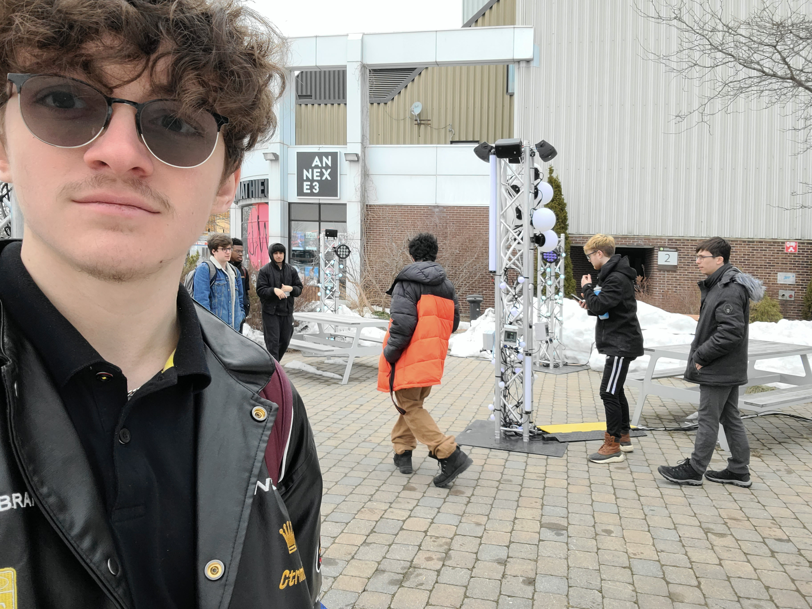
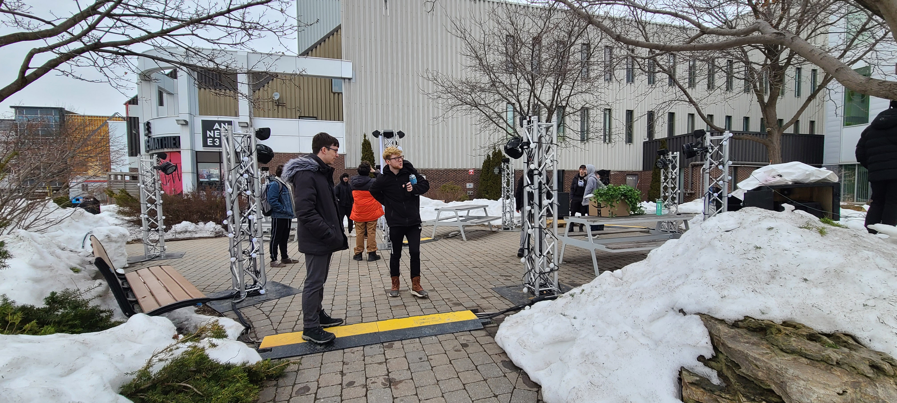
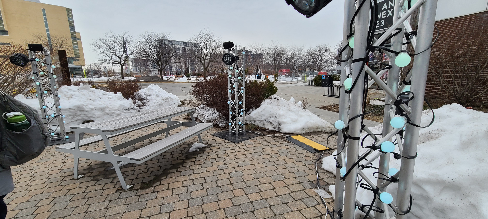
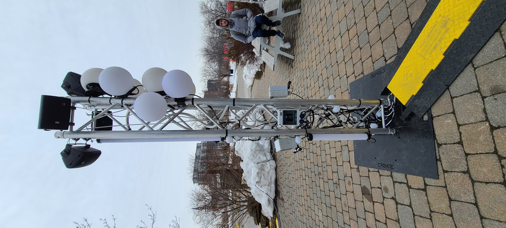
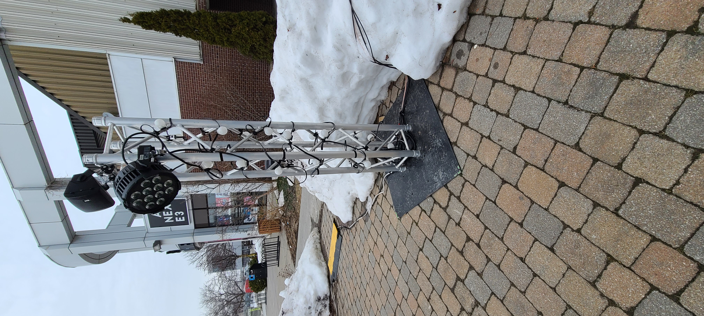
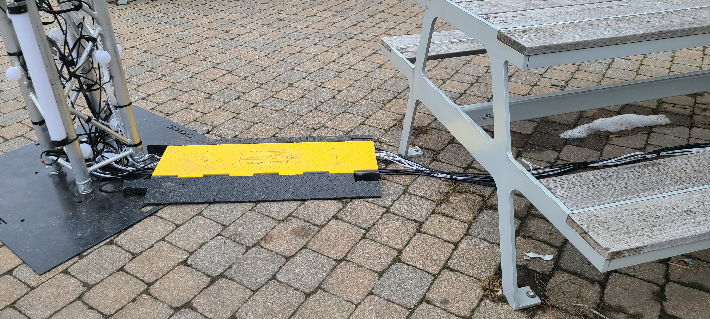
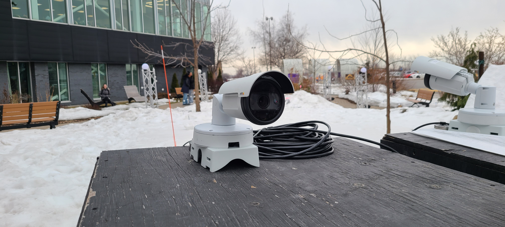
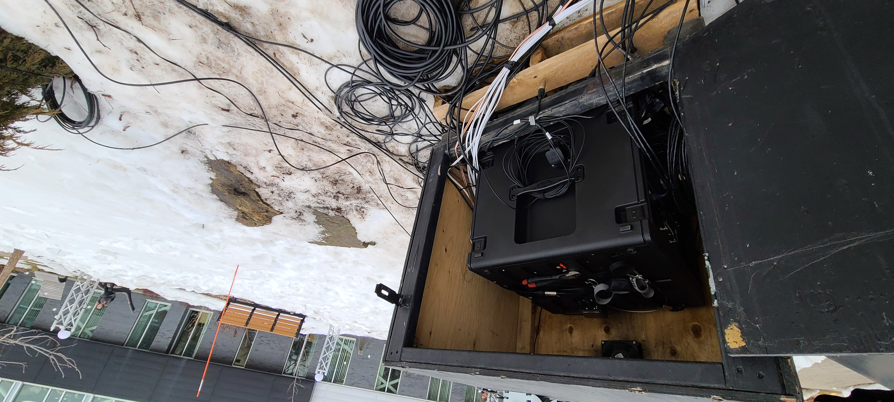
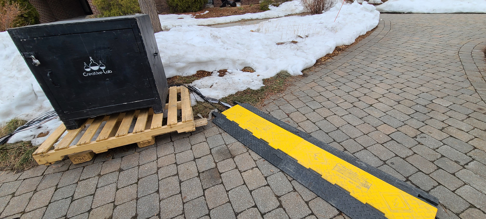

# Fiche de présentation Edria
## Edria
Edria est une oeuvre entièrement faite par des élèves de troisième année du programme TIM au cégep Montmorency. Elwin Durand, Loic Delorme, Dominic Roberts, Gabriel Leblanc, Meryem Berbiche et Jean-Cristophe sont les créateurs du projet.

Edria était exposé sur le terrain du cégep montmorency près de la salle André Mathieu. C'était une exposition temporaire qui a duré une semaine. J'ai personnellement visité l'oeuvre le 17 mars 2023 avant son exposition officiel qui a débuté le 20 mars 2023.

Edria est une oeuvre intéractive qui joue avec l'ambiance intéractive grâce à un jeu de lumière et une trame sonore envoutante. L'oeuvre est faite pour être visité durant la nuit quand il fait plus sombre. Sans cela l'ambiance est moins bien réussis. Malheureusement, ma visite s'est déroulé le jours puisque c'était lors de notre cours de documentation.

Pour changer l'ambiance de l'espace de manière intéractive avec le public, l'équipe d'Edria a mit en place des capteurs de mouvements et des senseurs pour changer les lumières et le son selon la quantité de personnes dans l'espace. L'espace est aménagé avec des tables pour rendre l'endroit plus agréables et rendre la visite plus confortable.

La mise en place de l'oeuvre est plutôt simple pour optimiser l'espace. Il y a un poteau centrale et des poteaus secondaires qui l'entourent ce qui permet de définir l'espace allouer à l'oeuvre. Des tables y sont installées pour rendre l'endroit plus acceuillant.

*plan de l'équipe d'Edria https://tim-montmorency.com/2023/projets/EDRIA/docs/web/medias/gallerie/visualisation.png

Pour réaliser cette oeuvre les membres de l'équipes ont du programmer l'intégralité des lumières, des senseurs et des sons. Ce qu'ils appellent le «mapping» consiste à programmer ces derniers ensembles ce qui a été un défi, mais ils y sont parvenue avec succès.

 

Beaucoup de matériel est nécéssaire à l'exposition d'une telle oeuvre. Entre autre des haut-parleurs, beaucoups de lumières intelligntes, des senseurs, des ordinateurs/serveur pour faire marcher le tout. De plus Tous les fils de l'oeuvre sont protégés par des caches fils et le tout est constamant surveillé par caméra de surveillance.

 
 

Je n'ai pas vu l'oeuvre de nuit. Durant la journée les lumières n'éaient pas très visible, mais rien qu'à entendre la bande sonore je savais que l'oeuvre était réussite et que l'ambiance désiré allait être la bonne. L'ambiance est intéractive et les lumières et le son changent selon l'emplencement et le nombre de visiteurs. Cet apect est selon moi très intéressant et amusant. Cela rendra probablement l'expérience du visiteur unique ce qui est définitivement un point fort de l'oeuvre. Toutfois, l'apect négatif est le même. L'aspect intéractif de l'oeuvre est difficile à comprendre et utilisé ce qui peut rendre le visiteur confu ou de ne pas le faire rester dans l'espace plus longtemps.
