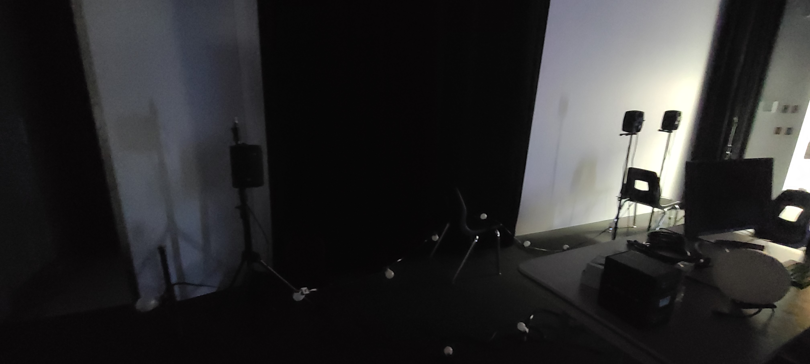

# 1. Boucler la boucle / Nexum

Sebastien Reilly, Sabrina Laforest, Alexendre Daniel, Maxime Des Lauriers

## Lien avec Mycelium

Le Mycelium est le réseau utilisé par les êtres vivants dans la nature. Ce réseau connecte tous ces êtres. C'est ce que tente de représenter le projet Nexum. Ce projet se situant dans les petits chemins à l'entré de l'école, connecte les projets LumaSol et Edria. Tous les éléments de leur projet représentent les connections et le réseau qu'est le Mycelium. Par exemple: la connection entre l'homme qui intéragie et l'instalation elle même, entre la nature du sentier et la tchnologie du projet etc.

## Installation du projet

Le projet sera situé dans les sentiers devant le cegep, il y aura des lumières et du son intéractif.

## Schéma d'installation

https://github.com/Boucle-RDDL/Nexum/blob/main/docs/preproduction/medias/Passe_lumiere.png

## Cours important à la réalisation du projet
* Traitement vidéo
* Animation 2D
* Conception de proet multimédia
* Son

## Technique d'installation

Le logiciel MadMapper a été un défi pour l'équipe de Nexum pour connecter les capteurs avec le son et la lumière.

## Expérience ressentie

Ce qui fait que je préfere ce projet aux autres est que j'admire ce que ce projet fait en transformant cette simple petite balade en une expérience immersive magnifique.
