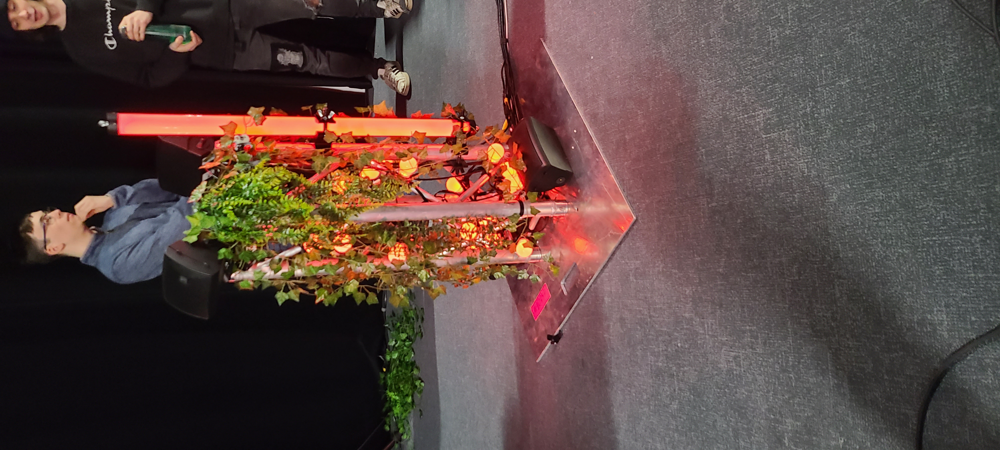
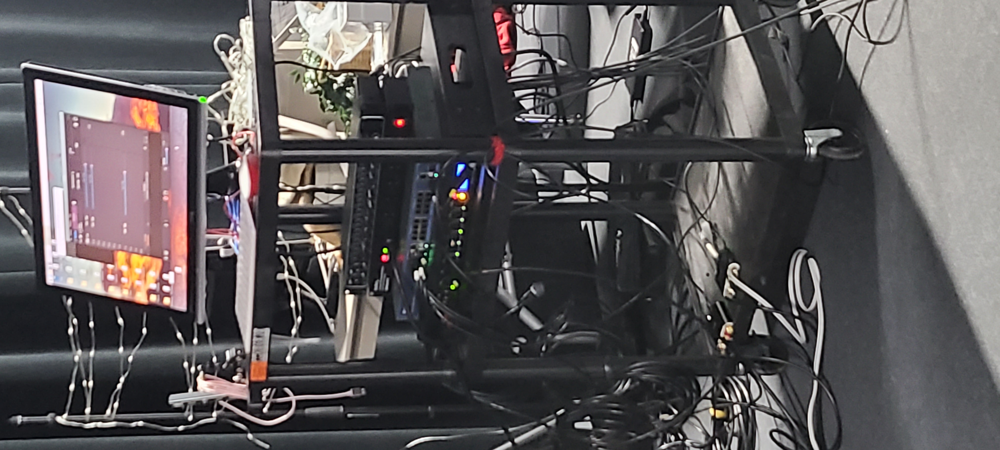

# 2. Edria
Conceptualisé par : Elwin Durand, Loic Delorme, Dominic Roberts, Gabriel Leblanc, Meryem Berbiche et Jean-Cristophe.

Lien avec Mycelium, le projet Edria connecte la nature et le réseau mycelium à ses lumières pour exprimer la dualité entre technologie et nature.

L'installation de ce projet sera à l'extérieur du cégep près de la porte 3. Il y aura des lumières, des structures pour les tenir dans lesquels il y aura des plantes. Des tables à pic-nic y seront aussi installé pour rendre l'endroit plus confortable.

Schéma d'installation

https://tim-montmorency.com/2023/projets/EDRIA/docs/web/medias/gallerie/visualisation.png

Cours importants
* Animation 2d
* Cours de MadMapper
* Installation multimédia

Élèment difficile lors de l'installation
L'intégration de tous les logiciels ensemble pour que tout fonctionne à été un défis pour l'équipe d'Edria

Expérience ressenti
Je pense que ce projet pourra vraiment donner de la vie à la devanture de l'école les lumières et les bruitages ambianceront non-seulenent les gens à l'intérieur de l'espace, mais aussi ceux à l'extérieur.
