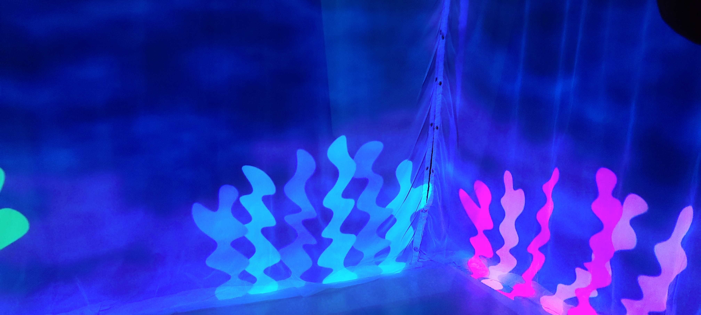

# 3. Echomarine
Conceptualisé par : 
Florence Lapierre, Natasha Abdallah, Tracy Gua et Maria Laura Coronel

Lien avec Mycelium
Le projet tente de reconnecter l'humain avec la nature en lui montrant les animaux marins qui sont en voie de disparition.

L'installation de se projet se déroule dans le petit studio. Le projet nécéssite 3 projecteurs, une kinect ainsi qu'un ordinateur.

Schéma d'installation

https://user-images.githubusercontent.com/90851849/215828565-a55f2ccf-d4f9-41c7-8c8c-05b6be81c631.png

Cours importants 
* Animation 2d
* Tous les cours de Web
* Traitement vidéo

