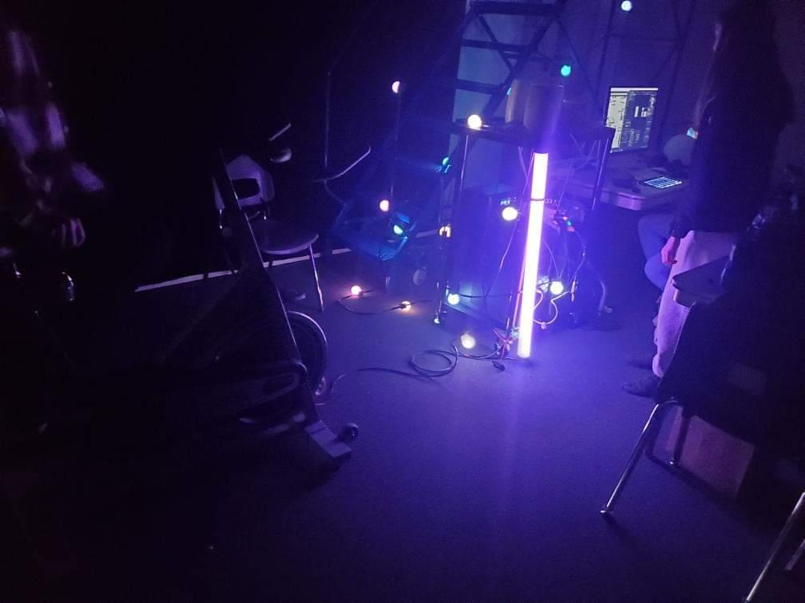

# 4. LumaSol
Conceptualisé par :
Éloise Gagner, Skayla Stimphil, Michael Simard et Pénélope Morisson.

Lien avec Mycelium
Le réseau du Mycelium permet au élèments de la nature de communiquer et eur projet incorpore un arbre avec lequel on intéragie. 

Leur projet se déroule à l'extérieur près de la porte du bloc c du cégep. Le projet nécéssite un vélo stationnaire, des lumières, un chargeur de téléphone et un moteur/alternateur.

Schéma d'installation
)
https://user-images.githubusercontent.com/78884924/216165170-5beeb3ab-4c1f-430b-b904-3b03000d772d.png

Cours importants :
* Traitement vidéo
* Animation 2d
* MdMapper

Expérience ressentie
Je pense que leur projet pourrait donner une bonne ambiance à la devanture de l'école. Toutefois, je ne crois pas que les gens pédaleront longtemps. Ce qui rendra le chargeur inutile et ils ne pourront donc pas explorer les quatres saisons.
