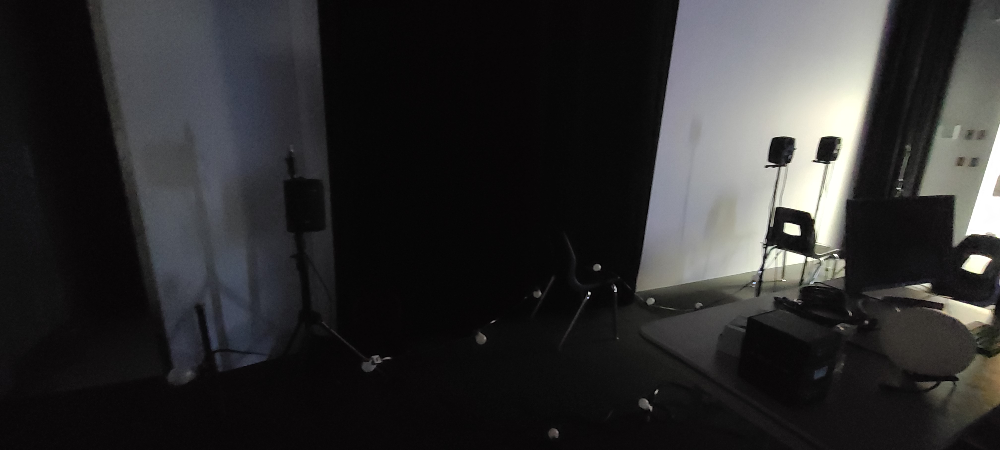

# Fiche de présnetation des projets Mycelium

1. Boucler la boucle / Nexum

Sebastien Reilly, Sabrina Laforest, Alexendre Daniel, Maxime Des Lauriers

Lien avec Mycelium
Le Mycelium est le réseau utilisé par les êtres vivants dans la nature. Ce réseau connecte tous ces êtres. C'est ce que tente de représenter le projet Nexum. Ce projet se situant dans les petits chemins à l'entré de l'école, connecte les projets LumaSol et Edria. Tous les éléments de leur projet représentent les connections et le réseau qu'est le Mycelium. Par exemple: la connection entre l'homme qui intéragie et l'instalation elle même, entre la nature du sentier et la tchnologie du projet etc.

Installation du projet
Le projet sera situé dans les sentiers devant le cegep, il y aura des lumières et du son intéractif.

Schéma d'installation

https://github.com/Boucle-RDDL/Nexum/blob/main/docs/preproduction/medias/Passe_lumiere.png
