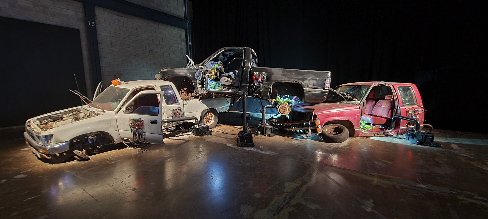

# Visite de la bian 2023

La biennale d'art numérique se déroulait se déroulait à l'Arsenal.
C'était une exposition temporaire que nous avons visité le 3 février 2023.
L'oeuvre que j'ai choisis d'analyser est *Tommorow's Borrowed Scenery*. 
Cette oeuvre a été créer par Paul Duncombe en 2022.
L'oeuvre expose trois camionnettes empilées, viellies et rouillées. Des plantes ont poussées à travers d'eux. Elles y sont entretenues par des robots composés de capteurs et de senseurs qui captent les besoins des plantes et leur donnent ce dont ils on besoin. 
