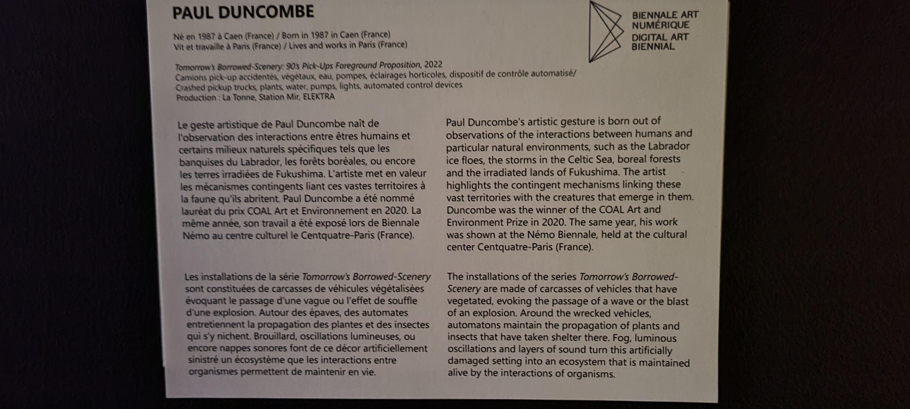
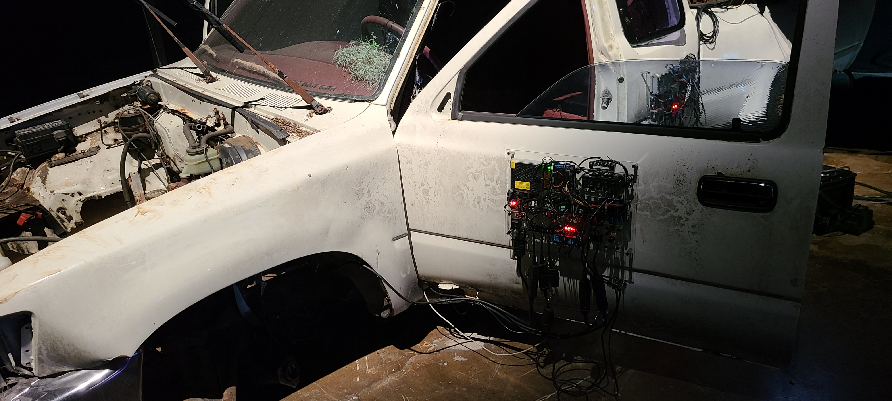

# Visite de la bian 2023

La biennale d'art numérique se déroulait se déroulait à l'Arsenal.
C'était une exposition temporaire que nous avons visité le 3 février 2023.
L'oeuvre que j'ai choisis d'analyser est *Tommorow's Borrowed Scenery*. 
Cette oeuvre a été créer par Paul Duncombe en 2022.

L'oeuvre expose trois camionnettes empilées, viellies et rouillées. Des plantes ont poussées à travers d'eux. Elles y sont entretenues par des robots composés de capteurs et de senseurs qui captent les besoins des plantes et leur donnent ce dont ils on besoin. 

C'est une oeuvre comtemplative, mais elle réussi à nous faire voyager dans un scénario future immersif.

VIDÉO TOMMOROW'S BORROWED SCENERY

La camionnette noir est déposée sur les camionnettes rouge et blanche. Des robots sont à l'extérieur afin qu'ils soient visibles. L'oeuvre nécéssite un grand espace pour exposé. L'oeuvre est placée au sol, mais elle a une hauteure conséquante puisque les camionnettes sont superposées. 

Pour exposer son oeuvre, l'artiste a du empiler les camionnettes. Il a aussi du planter les mousses et autres plantes à l'intérieur des véhicules. Par la suite il a du créer et programmer les robots afin qu'ils puissent entretenir automatiquement les plantes. 
