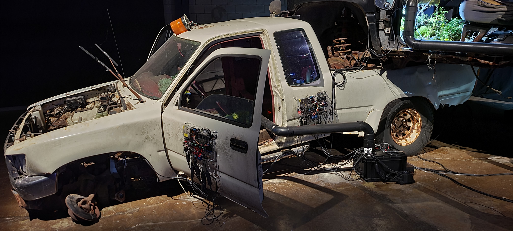
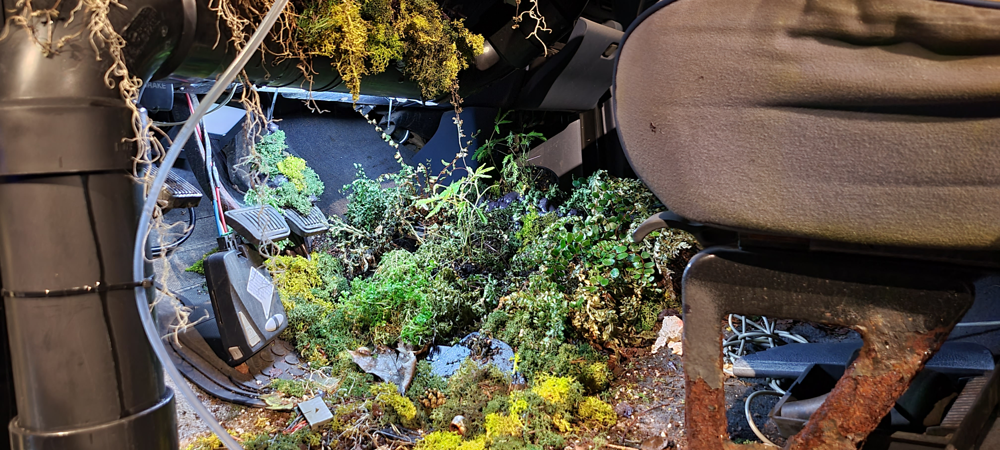
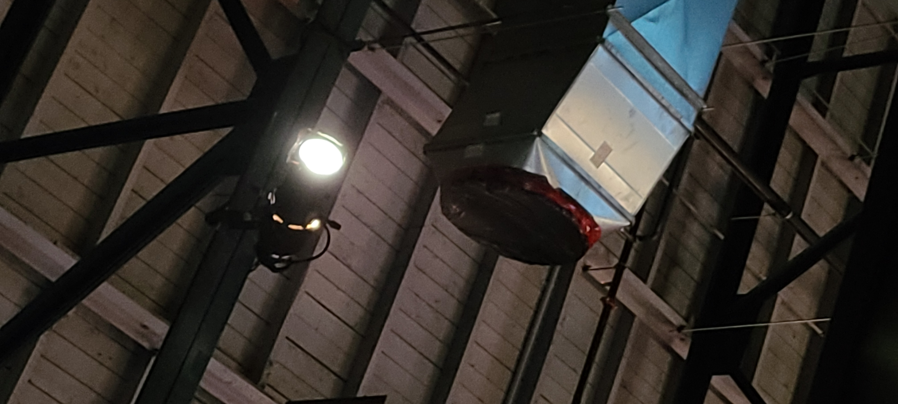
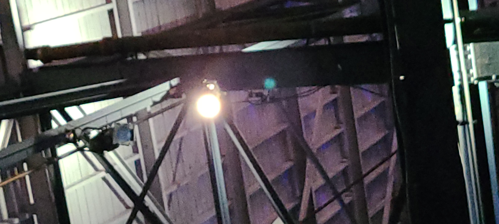
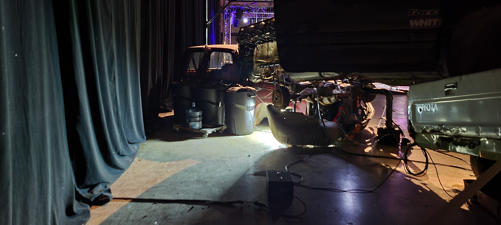
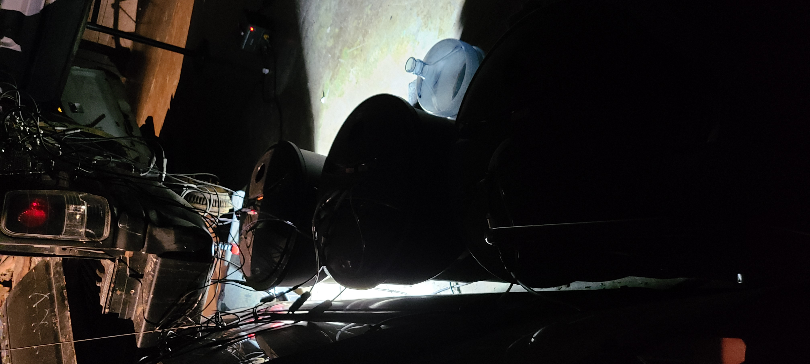
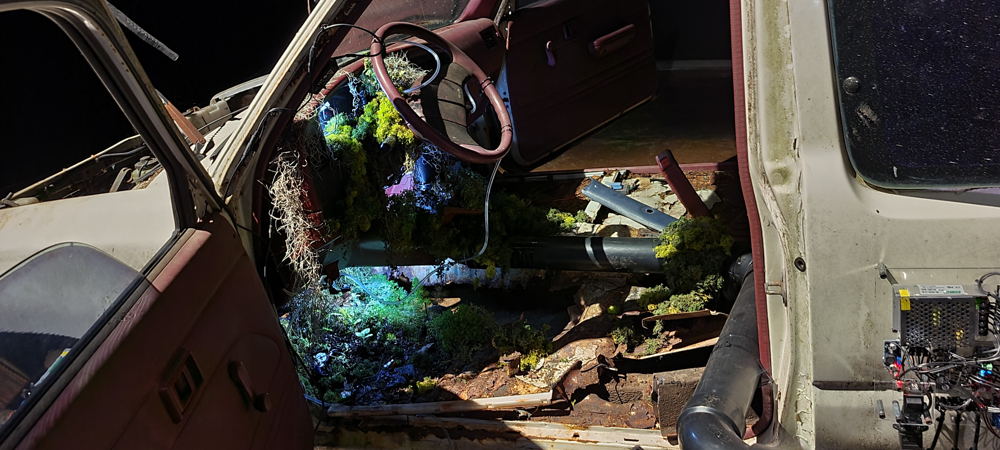

# Fiche présentation Tommorow's Borrowed Scenery

La biennale d'art numérique se déroulait se déroulait à l'Arsenal.
C'était une exposition temporaire que nous avons visité le 3 février 2023.
L'oeuvre que j'ai choisis d'analyser est *Tommorow's Borrowed Scenery*. 
Cette oeuvre a été créer par Paul Duncombe en 2022.

L'oeuvre expose trois camionnettes empilées, viellies et rouillées. Des plantes ont poussées à travers d'eux. Elles y sont entretenues par des robots composés de capteurs et de senseurs qui captent les besoins des plantes et leur donnent ce dont ils on besoin. 

C'est une oeuvre comtemplative, mais elle réussi à nous faire voyager dans un scénario future immersif.

VIDÉO TOMMOROW'S BORROWED SCENERY

La camionnette noir est déposée sur les camionnettes rouge et blanche. Des robots sont à l'extérieur afin qu'ils soient visibles. L'oeuvre nécéssite un grand espace pour être exposée. L'oeuvre est placée au sol, mais elle a une hauteure conséquante puisque les camionnettes sont superposées. 

Pour exposer son oeuvre, l'artiste a du empiler les camionnettes. Il a aussi du planter les mousses et autres plantes à l'intérieur des véhicules. Par la suite il a du créer et programmer les robots afin qu'ils puissent entretenir automatiquement les plantes. 

Afin de rendre l'exposition de l'oeuvre possible, il y avait du matériel fournit par le centre d'exposition. Dans ce matériel on retrouve: 
* deux projecteurs
* trois poubelles
* Un bidon d'eau

L'oeuvre donne une réelle impression d'être dans une scène post-apocaplytique. L'ambiance mise en oeuvre par l'artiste était très réussi. C'était impressionnant et fascinant de regarder les plantes se faire entretenir automatiquement par les robots. Cela a augmenté mon intérêt pour la programation puisque c'est ainsi que Paul Duncombe a réussi à créer des robots capables d'entretenir des plantes.

Un élément au sujet de cette oeuvre m'a beaucoup plu. Cette oeuvre a été recréer dans plusieurs pays. Selon le pays dans lequel l'oeuvre était exposée, l'artiste choisissait des voitures commune et plus utilisé dans les dits pays. Ici à Montréal, l'artiste a décidé d'utiliser des camionnettes ce qui fonctionne bien puisqu'en Amérique du nord le F-15O est le véhicule le plus vendu depuis plus de 20ans.
