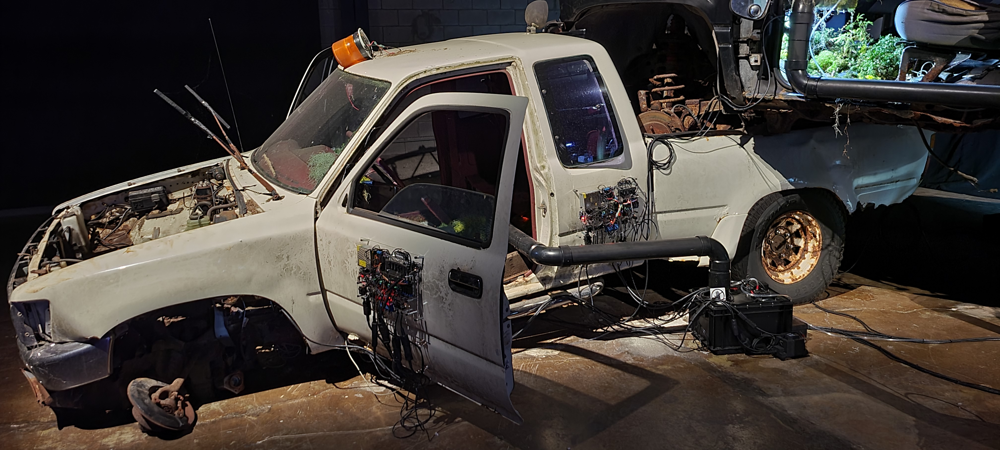
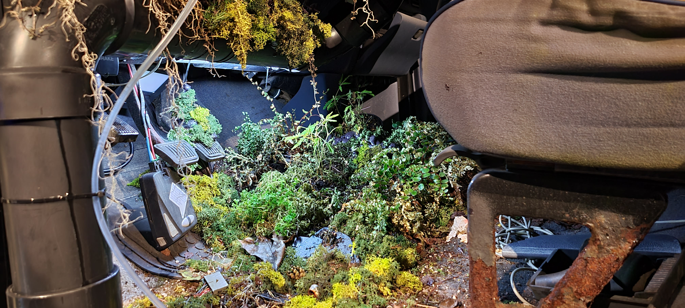
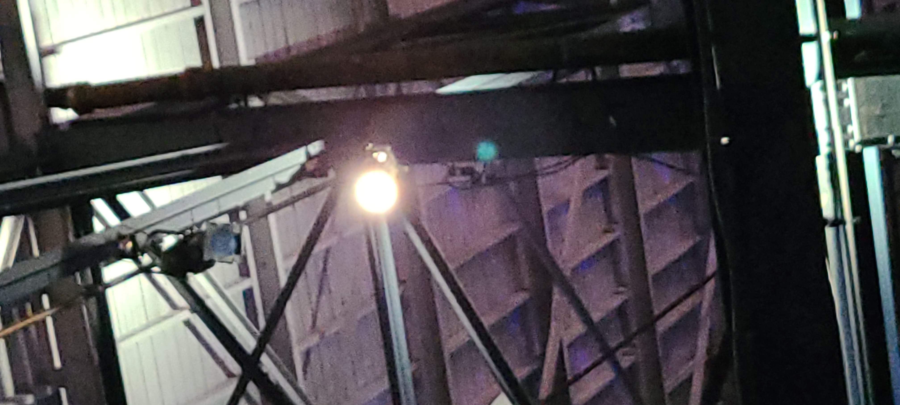
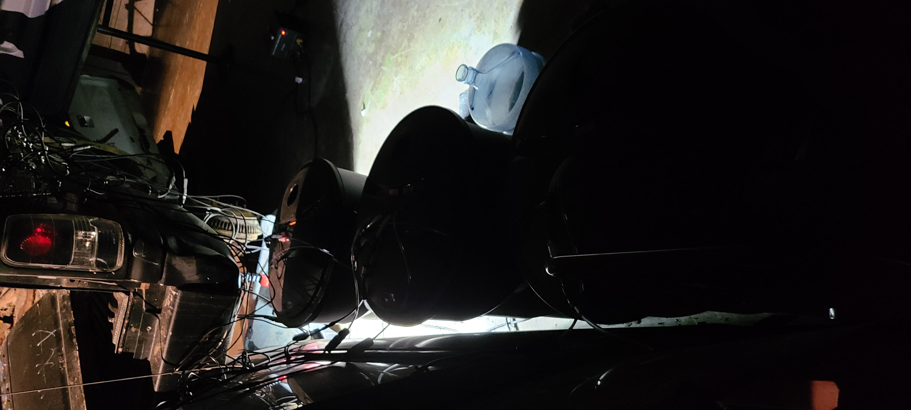
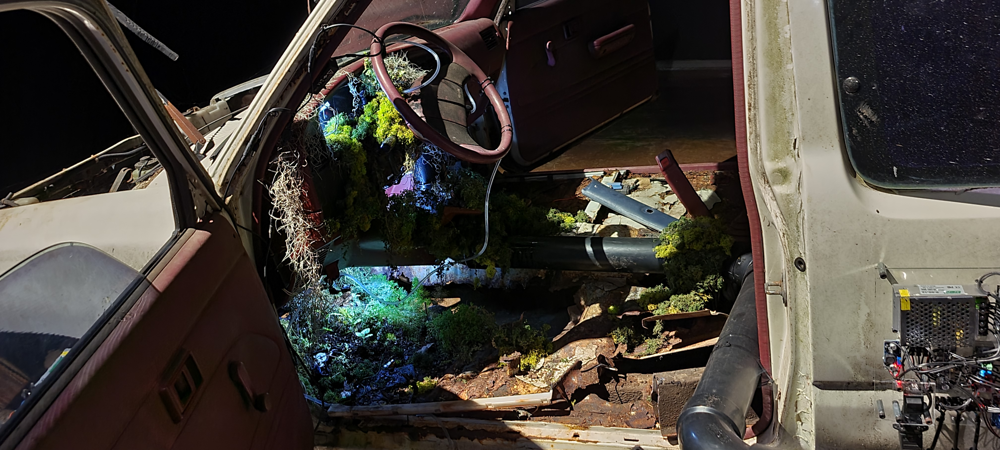
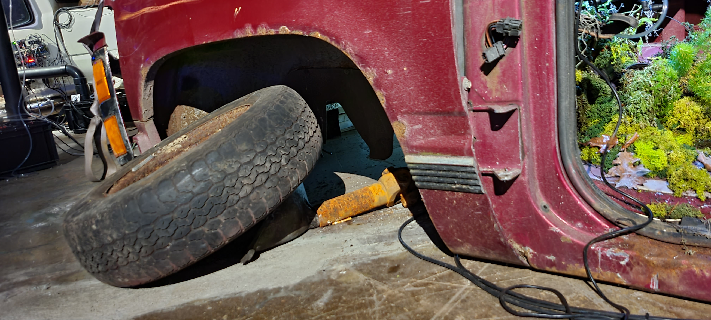

# Fiche de présentation de Tommorow's Borrowed Scenery

La biennale d'art numérique se déroulait à l'Arsenal.
C'était une exposition temporaire que nous avons visitée le 3 février 2023.
L'oeuvre que j'ai choisi d'analyser est *Tommorow's Borrowed Scenery*. 

Cette oeuvre a été créée par Paul Duncombe en 2022.

L'oeuvre expose trois camionnettes empilées, viellies et rouillées. Des plantes ont poussé à travers d'eux. Elles y sont entretenues par des robots composés de capteurs et de senseurs qui captent les besoins des plantes et leur donnent ce dont ils ont besoin. 

C'est une oeuvre comtemplative, mais elle réussi à nous faire voyager dans un scénario future immersif.

VIDÉO TOMMOROW'S BORROWED SCENERY

La camionnette noire est déposée sur les camionnettes rouge et blanche. Des robots sont à l'extérieur afin qu'ils soient visibles. L'oeuvre nécessite un grand espace pour être exposée. L'oeuvre est placée au sol, mais elle a une hauteur conséquente puisque les camionnettes sont superposées. 

Pour exposer son oeuvre, l'artiste a dû empiler les camionnettes. Il a aussi dû planter les mousses et autres plantes à l'intérieur des véhicules. Par la suite, il a dû créer et programmer les robots afin qu'ils puissent entretenir automatiquement les plantes. 

Afin de rendre l'exposition de l'oeuvre possible, il y avait du matériel fourni par le centre d'exposition. Dans ce matériel, on retrouve: 
* deux projecteurs
* trois poubelles
* Un bidon d'eau

L'oeuvre donne une réelle impression d'être dans une scène post-apocalyptique. L'ambiance mise en oeuvre par l'artiste était très réussie. C'était impressionnant et fascinant de regarder les plantes se faire entretenir automatiquement par les robots. Cela a augmenté mon intérêt pour la programmation puisque c'est ainsi que Paul Duncombe a réussi à créer des robots capables d'entretenir des plantes.

VIDÉO FONCTIONNEMENT DES ROBOTS

Un élément au sujet de cette oeuvre m'a beaucoup plu. Cette oeuvre a été recréée dans plusieurs pays. Selon le pays dans lequel l'oeuvre était exposée, l'artiste choisissait des voitures commune et plus utilisée dans lesdits pays. Ici à Montréal, l'artiste a décidé d'utiliser des camionnettes ce qui fonctionne bien puisqu'en Amérique du Nord le F-15O, de la marque Ford, est le véhicule le plus vendu depuis plus de 20ans. Toute fois, aucun F-150 était présent dans l'oeuvre, mais les camionnettes donnaient quand même l'impression de familiarité avec l'oeuvre.

À l'opposé, certains éléments m'ont moins plu. Par exemple, l'oeuvre étant exposée avec d'autres oeuvre, son ambiance sonore était polluée par d'autres oeuvre adjacentes. L'une des oeuvres voisines à TOMMOROW'S BORROWED SCENERY avait une bande sonore qui jouait très fort et qui nuisait à l'ambiance de l'oeuvre de Paul Duncombe. De plus, certains éléments mécaniques sur les camionnettes avaient moins de sens à mon avis. L'élément que j'ai remarqué en premier est la roue avant gauche de la camionnette rouge. La roue ainsi que les pièces de suspensions étaient manquantes alors que les pièces du mécanisme de freinage étaient présentes. Ceci est illogique puisque les freins se retrouvent entre la roue et la suspension. Donc en  imaginant que les pièces manquantes auraient été dérobées, car c'est ce qui est le plus logique dans ce scénario, je me demande pourquoi les "voleurs" auraient pris le temps de reposer les freins au lieu de les garder aussi.

