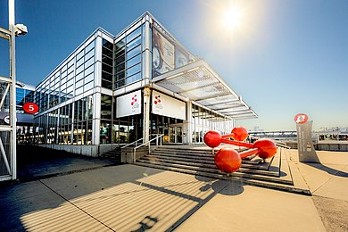
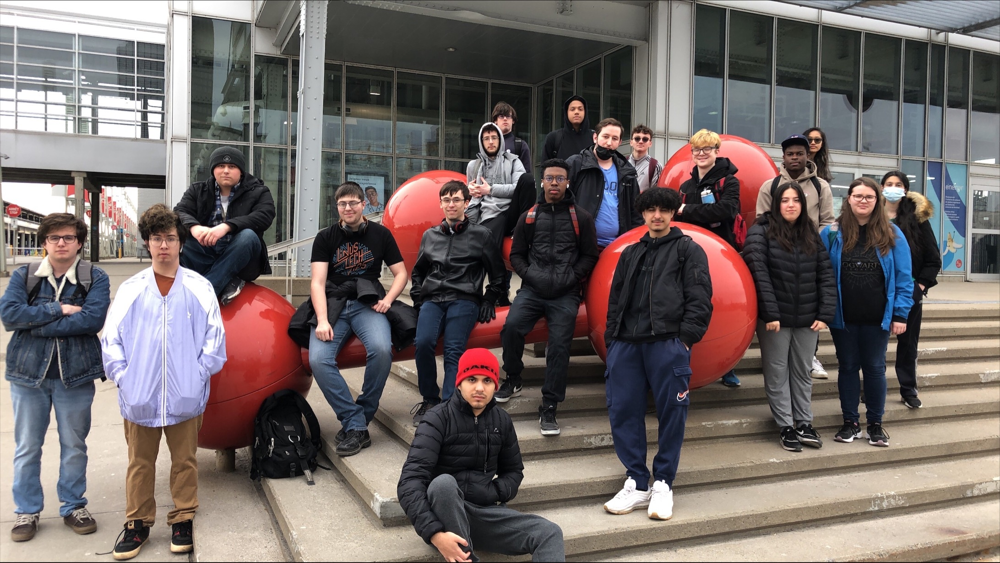
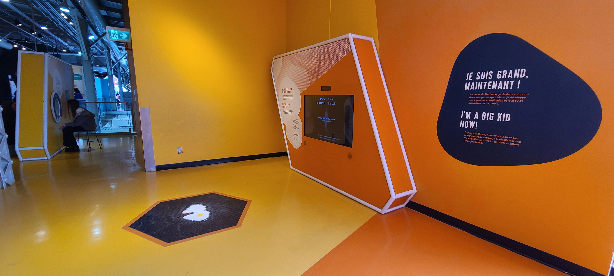
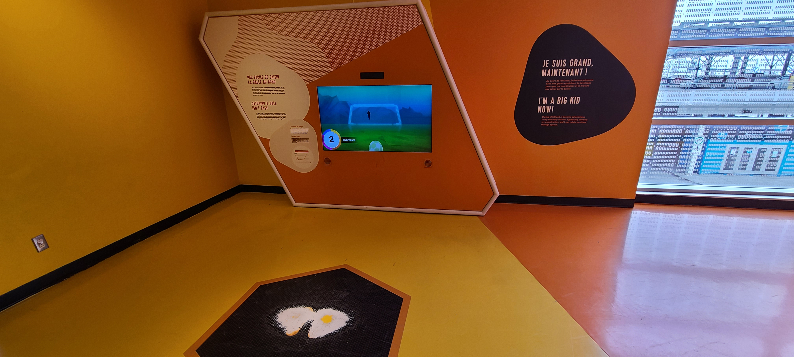
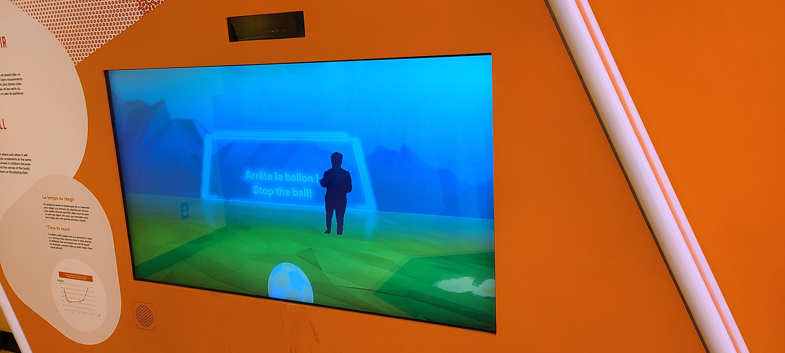
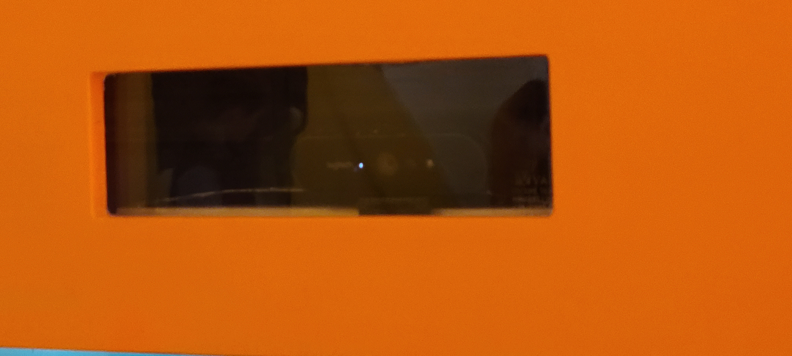
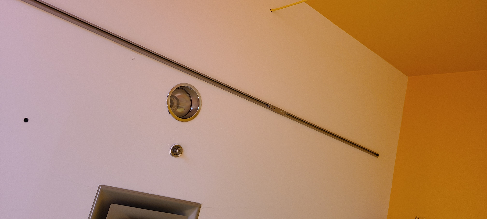
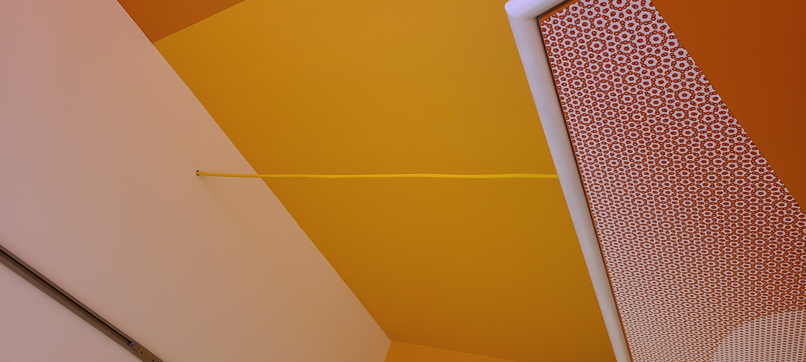
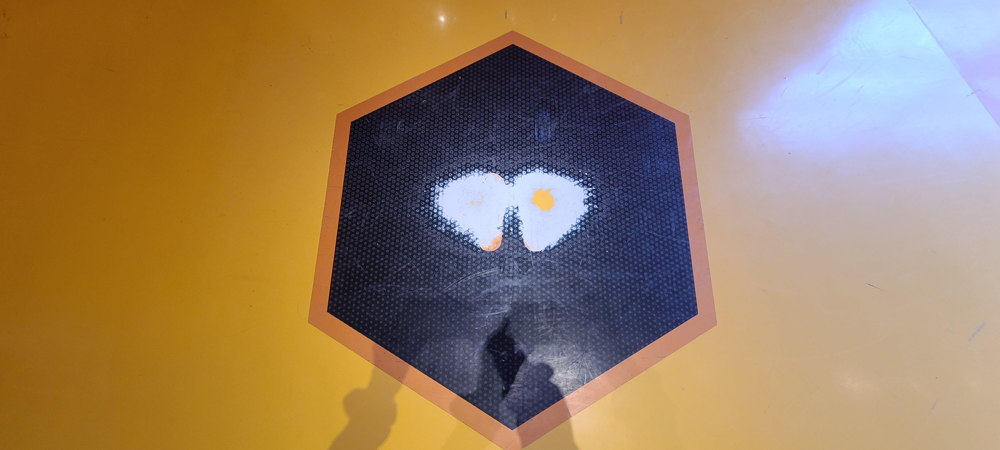
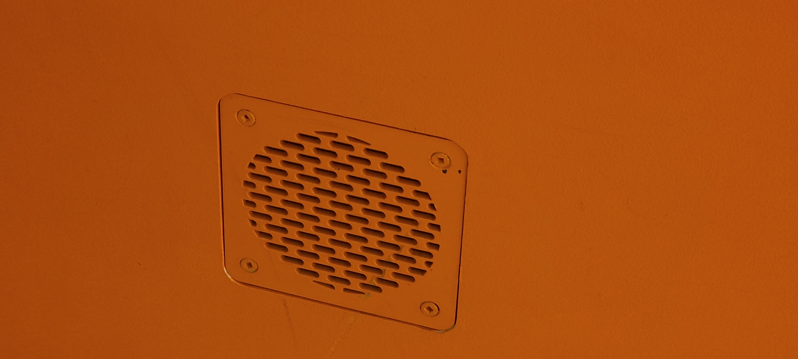

# Fiche de présentation du dispositif «Pas facile de saisir la balle au bond»

Le 12 avril, nous avons visités le centre des sciences entre autre l'exposition Human.

 
L'exposition Human est une exposition permanente au centre des sciences de Montréal. À l'entrer de l'exposition plusieurs dispositifs ludique étaient présent. Un des dispositif était «Pas facile de saisir la balle au bond» Ce dispositif est un jeu où le'utilisateur doit attraper un ballon de soccer comme un gardien de but. Un écran permet de voir sa silouhette par rapport au ballon. Le but ludique du dispositif est de montrer le temps de réaction et les reflexs par rapport à l'âge d'une personne. Chaque tir à arreter nous montre le temps de réactions selon un certao=in âge.

Vidéo du dispositif

Ce dispositif intéractif permet d'apprendre et d'observer les reflexs d'une personne selon son âge tout en étant amusant. Le dispositif n'est pas très grand. Il est principalement constitué d'un module avec un écran et des explication. Il y a un petit espace au sol désigné par un collant qui nous indique où se positionner pour jouer au jeu.

Le dispositif requiert seulement une webcam, un écran et un ordinateur qui contient le logiciel programmé pour faire marcher le jeu.

 

Pour que ce jeu soit exposé, le centre des sciences a du y ajouter quelques accessoires. Tel que : une lumière, un autocollant au sol pour positionner le joueur, des cable et un petit système de ventillation pour l'ordinateur à l'intérieur.

   
