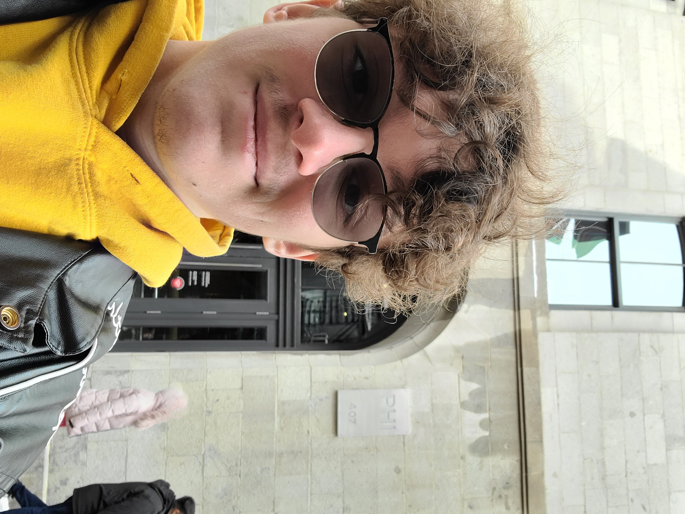
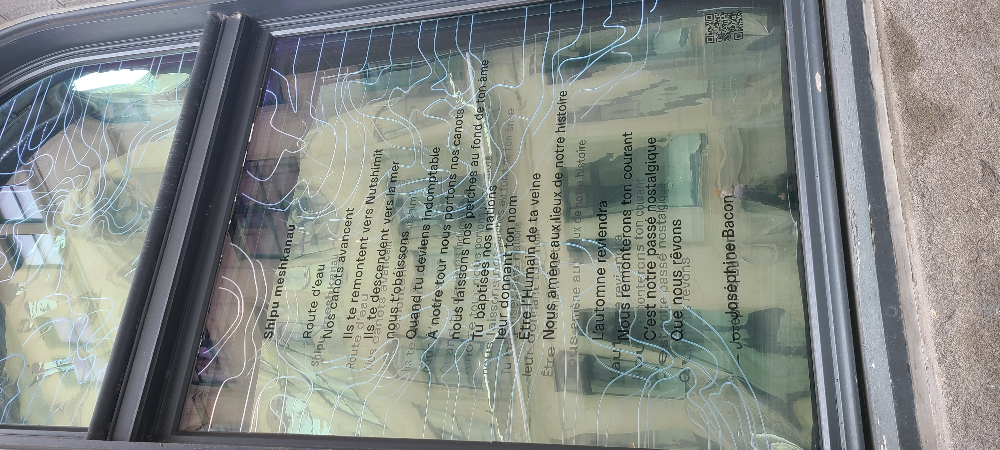
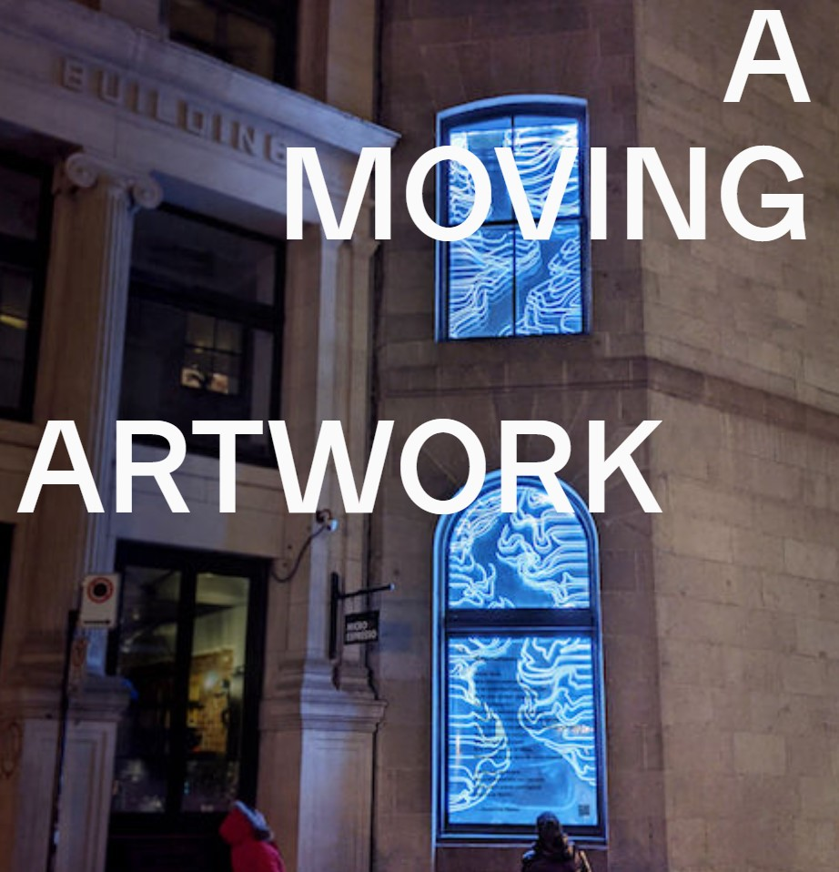
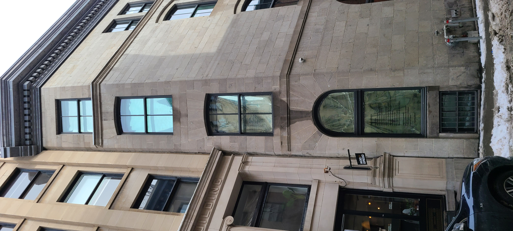

# Fiche de présentation de l'oeuvre: La route d'eau.

## Centre PHI
Cette oeuvre temporaire était en exposition au centre PHI du 24 Novembre au 1er Avril.

Le centre PHI est installé sur la rue St-Pierre dans le cartier du vieux-Montréal, près du port. Je m'y suis rendu le 1er Mars durant la journée.

## La route d'eau

La route d'eau est une oeuvre poétique écrtite par Joséphine Bacon et mise en valeur par l'installation de Sylvain Dumais et Phoebe Greenberg et la trame sonore de Kelly Nunes. Ce poème a été écrit en 2021 par la poète Inuite Josephine Bacon.

### Description
Le poème est affiché dans la fenêtre à l'étage du rez-de-chaussée. Toutefois, l'installation prend place sur trois autres fenêtres au dessus de celle avec le poème. Des lumières sont installées derrière les fenêtres pour qu'une fois la nuit tombée les fenêtres attirent plus l'attention des passants. Pour ma part, ayant visité l'oeuvre en pleine journée, je n'ai pas pu vivre l'expérience pleinement. Voici une image provenant du site internet du centre PHI pour comprendre à quoi ressemble cette oeuvre de nuit.

Cette oeuvre est contemplative. Sa taille étant assez petite ne nous transporte pas. Toutefois, le poème lui est nous fait voyager. L'autrice nous image bien ce voyage en canoe ce qui le rend très beau et touchant.

Le multimédia est présent dans cette oeuvre, mais il n'y est pas au coeur. Le seul élément multimédia est la lumière. Des bandes LED sont installées dans les fenêtres et sont animées pour donner une impression d'eau qui coule.

Lees fenêtres sont visible depuis la rue st-pierre à Montéal. Les fenêtres sonts alignées à la verticale.

L'oeuvre ne demandait pas énormément de matériels puisqu'ils n'y a que le poème et les lumières. Il y a donc des collants de lettres ainsi que de nombreuses bandes LED. Toutefois, il est difficile de dire ce qui est acheter ou fait par l'auteur ou par le centre.

Malgré la beauté du poème, mon expérience lors de la visite de cette oeuvre a été un peu déceuvante. Je m'attandais à quelque chose de plus gros. De plus, comme j'ai visité le centre PHI en plein jour les lumières ne rendait pas aussi bien que lorsque nous les voyons de nuits comme sur le site. Malheureusement, je n'ai pas trouvé de vidéo sur le web qui montre l'oeuvre de nuit.

Le poème est magnifique. Les mots de l'autrice nous font voyager dans l'espace et dans le temps. En le lisant je m'imaginais, jeune Inuit, en cnoe sur le fleuve comme à l'époque.

Si je devais changer quelque chose à propos de l'oeuvre deux possibilitées s'offriraient à moi. Sois je modifierais la page internet pour dire au visiteurs de venir de nuit. Ou encore, je mettrais l'oeuvre à l'intérieur pour pouvoir mieux contrôler la lumière ambiante.

liens vers le site officiel du centre PHI.
https://phi.ca/en/events/water-road/
